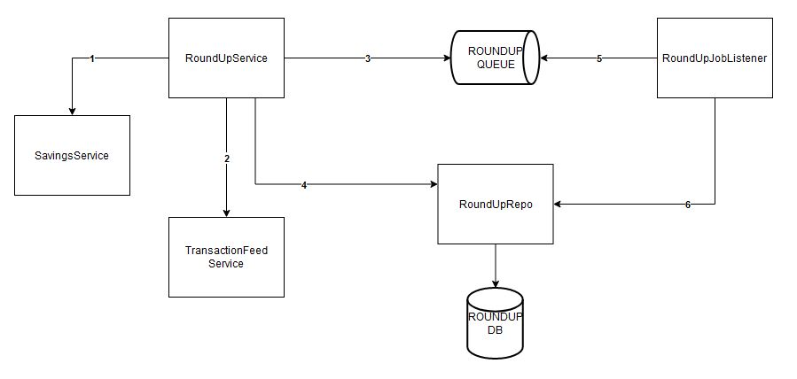
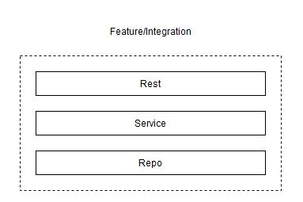

# Round Up Service
- [Assumptions](#assumptions)
- [Notable Edge Cases](#notable-edge-cases)
- [User Workflow](#user-workflow)
- [API Design](#api-design)
  * [Structure](#structure)
    + [Domain Driven Design](#domain-driven-design)
    + [RoundUpJob table design](#roundupjob-table-design)
- [Tech Decisions](#tech-decisions)
- [Customer Feedback](#customer-feedback)
- [TODO](#todo)

## Assumptions
1. The starling bank round up API feature does not exist.
2. Users are using this third party Round Up service to perform this round up saving feature.
3. We do not want to round up the transactions of the current (and unfinished) day.
4. In the event that a previously rounded up transaction has been refunded, do not "undo" the previous savings goal update. 
5. The round up feature is not time sensitive. Users do not need an immediate result.

## Notable Edge Cases
- We receive 0 transactions.
- We receive a transaction where money has come into the account instead of out.
- Thousands of transactions received from the week (careful memory!).
  - process each day asynch using sqs messages.
  - return response to user with job ids and continue processing asynch.
  - add endpoint for checking job status (webhook?)
  - ...beginning to consider the alternative approach of processing the week as a whole and having auto-scaling policies trigger for large jobs.
- Fail to round up a transaction.
  - Consider retries, message DLQ.
- We call round up on the same transaction.
  - Each request must be idempotent. This requires persistent storage for keeping track.
- We receive transactions that have not been settled.
  - We create the job but send to DLQ. An incorrect round up is worse than a failed round up (from my perspective as a user).
  - I actually don't want savings goal expense items from the endpoint (/api/v2/feed/account/{accountUid}/category/{categoryUid}/transactions-between)
    - So will instead be using the settled-transactions-between endpoint for main account expenses
- What happens when the total round up amount is more than the accounts current balance?
  - Put message in DLQ or delete, we do not want a scenario where the user is low on funds and cannot use their account because of queued messages being processed.
  - Each job is a days worth of transactions, so it is important not to interfere with this potential living fund.
  - DLQ re-driving is an issue since we may process stale transaction data. (What is stale data? Just unsettled transactions?)
    - We shouldn't have the message consumer do a fresh fetch each time since it does not scale well, and we could hit our api rate limit. Because of this, transaction data should stay in the message.
  
 

> Not using the starling `GET /accounts` or `GET /spaces` endpoints since the fetch can return multiple accounts and a decision 
must be made on which account to perform the round up on.
I do not believe this kind of decision should be automated since the consequences are large.
Performing the roundup on all accounts/spaces returned by the aforementioned endpoints, is also not ideal since the operation would be incredibly impactful with large consequences.
The service should instead require that an account id and savings goal id is provided in order to operate on the exact resources.
These granular actions can be repeated for however many accounts the user requires.

## User Workflow
1. Uncle Iroh wants to round up all the transactions from the past week and add it to a specific savings goal
2. Iroh sends a request to this Round Up API providing his account and savings space id
3. The Round Up service takes this request, creates an asynch job (check if existing in DLQ) and responds with a 202 and a job id
4. The job processes asynchronously. It fetches Irohs transactions from the last week, rounds them up, calculates the difference and makes the required transaction from his account
5. Once complete, the job status is updated.
6. Uncle Iroh wants to check if the round up has completed and so makes a request to the jobs endpoint.
7. The jobs endpoint returns with a status of complete.

 

## High level design

 

  

 

## API Design

| HTTP Method | Endpoint                      | Example Request Body                                                                                                                                                                                           | Example Response Body                                  |
|-------------|-------------------------------|----------------------------------------------------------------------------------------------------------------------------------------------------------------------------------------------------------------|--------------------------------------------------------|
| GET         | /api/v1/roundupjob/2024-03-11 |                                                                                                                                                                                                                | { &emsp;"status":"complete" }                  |
| POST        | /api/v1/roundupjob            | { &emsp;"startDate": "2024-03-11", &emsp;"endDate": "2024-03-12", &emsp;"accountId":"ed242cb1-eee2-4eff-930c-0397c60ee478", &emsp;"savingsGoalId":"f83832cb-0eb3-4c30-9d2b-57e841832e29" } | [ &emsp;"2024-03-12", &emsp;"2024-03-11" ] |

### Structure

The code is to be split into rest service and repo layers for separation of responsibility.
The rest layer is for web controllers and are the entry point to the system. They define the API endpoints that users will operate.
The service layer is for business logic and for processing data from the repo layer.
The repo layer is for fetching data, typically from databases or via network calls.

#### Domain Driven Design
The API should be structured by features.
This means having a parent feature package com.alvin.roundup and then within this feature package, we have our rest, service and repo packages.
If this service extends to support more features, this should be done within a separate package (e.g. com.alvin.newfeature).
This is useful in the event that the monolith service requires splitting into a separate microservice as it becomes easier to rip out a single package instead of individual classes.

 

  

 

#### RoundUpJob table design

|    | **ID**      | **ACCOUNT_ID**     | **SAVINGS_GOAL_ID**   | **TRANSFER_ID**      | **STATUS**   |
|----|-------------|--------------------|-----------------------|----------------------|--------------|
|    | 2024-03-11  | ed242cb1-eee2...   | f83832cb-0eb3...      | 57e841832e29-4c30... | COMPLETE     |
|    |             |                    |                       |                      |              |

The ID field is the string representation of the date. Since a job processes a single day, using the date becomes an easy visual identifier.
We record the status of a job to not repeat the round up operations on day. Before we process a day, we must check if an existing job exists
that is completed, and if so end the operation, but return job ids to the user.

 

***

## How it would scale

Simple ideas on scaling the solution, by focusing on single points of failure.

 

  

> The round up service has a single point of failure so this can be the first to scale horizontally. We will also need a 
load balander to decide where to send requests to.
 

 

  

> What if a load balancer fails? Add another one and have a DNS record route the request to the load balancer. If a load balancer fails,
the user will be able to route traffic to the other load balancer using the backup record.
Data redundancy with multiple databases. Split the read/writes for masters and read replicas and allow asynch replication.

 

 

  

> Add a connection pool for managing database connections.

- The next thing to consider is hardware failures (server rack goes down).
- Must also consider region failures and deploy infrastructure in multiple availability zones.
- Security concerns will have us deploying the services within private VPCs.
 

## Tech Decisions
- Java
- SpringBoot
- ActiveMQ
  - If I had more time, I would have my solution use AWS SQS. Much nicer to implement and it supports proper re-driving of DLQ
- H2 DB
  - Would rather use a persistent storage solution. DynamoDB since it is cheap and easy to implement.

 

## Customer Feedback
>**Uncle Iroh**
> 
>I don't like manually performing a savings round up of my week in order to achieve my savings goal target.
It is difficult to maintain a weekly budget when the round up is performed at the end of the week instead of immediately after a transaction.
I have a £3 weekly budget. I spend £1.50 on tea, and then I spend another £1.50 on tea which is within my budget. The round up then makes both of these
transactions worth £2, making my tea expenses £4 which is over budget!.

## TODO
- http://localhost:8161/admin/queues.jsp
- http://localhost:8080/h2-console
- Possibly add a webhook for checking job status
- Add log lines, follow from endpoint to repo, purposeful and efficient logs
- Add endpoint to fetch the days that have been processed
- Handle possible db write fails
- Add endpoint or system for dlq redrives
- Add proper spring security implementation
  - Fetch and set user object in security context when authenticating a provided jwt in the security filter chain.
- Do proper error handling with appropriate responses
- Use retryable annotation for handling unexpected failures